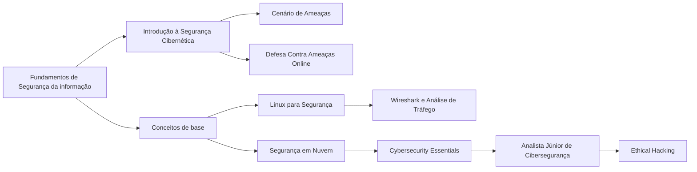

<h1 align="center">Fundamentos de Segurança da Informação

## Bem-vindo(a) ao primeiro passo dessa jornada!
&nbsp;&nbsp;&nbsp;&nbsp;Neste espaço, você terá acesso a conteúdos e conceitos fundamentais para iniciar sua jornada de estudos em segurança
 da informação. Após a conclusão dos cursos, acesse o PDF com o exercício para reforçar seu aprendizado. É altamente recomendável 
que você realize esse desafio, pois ele será a base para os próximos passos. Tente seguir a trilha de cursos conforme a sequência 
a baixo, qualquer dúvida perginte em nosso servidor no Discord. Dedique-se e aproveite ao máximo essa oportunidade de 
aprimoramento!

## Fundamentos:

1. **Introduction to Cybersecurity | Cisco**  
   [Introduction to Cybersecurity by Cisco: Free Online Course](https://www.netacad.com/courses/intro-cybersecurity)

2. **Segurança cibernética | IBM**  
   [Cursos gratuitos de segurança cibernética para estudantes | IBM SkillsBuild](https://www.ibm.com/skills/build)

3. **Como se defender contra ameaças Online | Academia Forense Digital**  
   [Fundamentos de Cibersegurança: Como se Defender Contra Ameaças Online](https://www.academiaforensedigital.com.br)

4. **Segurança em tecnologia da informação | Fundação Bradesco**  
   [Segurança em Tecnologia da Informação - Fundação Bradesco - Escola Virtual](https://www.ev.org.br)

5. **Fundamentos de segurança cibernética | Cisco**  
   [Cybersecurity Essentials Course with Real-World Scenarios](https://www.netacad.com/courses/cybersecurity-essentials)

6. **Cybersecurity | FIAP**  
   [FIAP EAD - Login](https://on.fiap.com.br)

7. **Introdução ao cenário de ameaças (EN)**  
   [Introduction to the Threat Landscape](https://www.cybrary.it/course/introduction-to-the-threat-landscape/)

8. **Introdução à segurança cibernética (EN)**  
   [Getting Started in Cybersecurity](https://www.cybrary.it/course/getting-started-in-cybersecurity/)

9. **Introdução técnica em cibersegurança (EN)**  
   [Technical Introduction to Cybersecurity](https://www.cybrary.it/course/technical-introduction-to-cybersecurity/)

10. **Junior Cybersecurity Analyst | Cisco**  
     [Junior Cybersecurity Analyst - Skills for All](https://www.netacad.com/pt/career-paths/cybersecurity?courseLang=pt-BR)

11. **Ethical Hacker | Cisco (EN)**  
    [Ethical Hacker - Skills for All](https://www.netacad.com/pt/courses/ethical-hacker?courseLang=en-US)

12. **Linux Fundamentos | FIAP**  
    [FIAP EAD - Login](https://on.fiap.com.br)

13. **Fundamentos da segurança em nuvem | Palo Alto**  
    [Cloud Security Fundamentals : Beacon](https://beacon.paloaltonetworks.com/student/collection/623418)

14. **Wireshark Do Iniciante ao Avançado | Youtube (EN) - Sem certificado**  
    [Wireshark Full Course 🦈| Wireshark Tutorial Beginner to Advance 🔆 Wireshark 2023](https://www.youtube.com/watch?v=ZxF6dXfQaNM)  
    **Ou**  
    **Wireshark analisando tráfego | Udemy R$39,90 - Com certificado**  
    [Wireshark Analisando Tráfego | Udemy](https://www.udemy.com/course/wireshark-analisando-trafego/)

15. **Hacktivities | TryHackMe**  
    [Link para Hacktivities no TryHackMe](https://tryhackme.com/hacktivities)

## O que você deve saber ao terminar essa trilha:
- **Fundamentos de Cibersegurança:** Compreensão de ameaças cibernéticas, princípios de segurança (CIA), e proteção de dados pessoais.  
- **Análise e Defesa Contra Ameaças:** Identificação e defesa contra ataques, resposta a incidentes e minimização de danos.  
- **Ferramentas e Técnicas de Segurança:** Uso de ferramentas como Wireshark e Nmap para análise de tráfego e práticas de segurança em nuvem.  
- **Segurança em Redes:** Monitoramento de redes, implementação de protocolos de segurança e gestão de identidades e acessos.  
- **Hacking Ético Básico:** Realização de testes de intrusão e uso de ferramentas como Metasploit e Nmap.  
- **Segurança de Sistemas e Aplicações:** Desenvolvimento seguro, criptografia e proteção de dados.  
- **Segurança Cibernética:** Criação de políticas de segurança, conformidade com regulamentações e planejamento de continuidade de negócios.  
- **Kali Linux:** Subir uma máquina virtual no virtual box, com configurações básicas.  

## Livros  
**Linux Guia Prático** - Daniel J. Barrett  
↳ [Link para compra na Amazon](https://www.amazon.com.br/Linux-Guia-Pr%C3%A1tico-Comandos-Essenciais/dp/8575229117/ref=asc_df_8575229117/?tag=googleshopp00-20&linkCode=df0&hvadid=709965221219&hvpos=&hvnetw=g&hvrand=2647529046542020359&hvpone=&hvptwo=&hvqmt=&hvdev=c&hvdvcmdl=&hvlocint=&hvlocphy=9215680&hvtargid=pla-2371569635208&psc=1&mcid=41c4ad98bd813e8fb754702b6398be14&tag=googleshopp00-20&linkCode=df0&hvadid=709965221219&hvpos=&hvnetw=g&hvrand=2647529046542020359&hvpone=&hvptwo=&hvqmt=&hvdev=c&hvdvcmdl=&hvlocint=&hvlocphy=9215680&hvtargid=pla-2371569635208&psc=1&language=pt_BR&gad_source=1)

**Testes de Invasão: uma Introdução Prática ao Hacking** - Georgia Weidman  
↳ [Link para compra na Amazon](https://www.amazon.com.br/Testes-Invas%C3%A3o-Georgia-Weidman/dp/8575224077)

**Testes de Invasão: uma Introdução Prática ao Hacking** - Georgia Weidman  
↳ [Link para compra na Amazon](https://www.amazon.com.br/Testes-Invas%C3%A3o-Georgia-Weidman/dp/8575224077)

**Segurança da Informação: Princípios e Práticas** - William Stallings  
↳ [Link para compra na Amazon](https://www.amazon.com.br/Seguran%C3%A7a-Inform%C3%A7%C3%A3o-Princ%C3%ADpios-Pr%C3%A1ticas-William/dp/8535249073)

**Hacking: The Art of Exploitation** - Jon Erickson  
↳ [Link para compra na Amazon](https://www.amazon.com.br/Hacking-Art-Exploitation-2nd/dp/1593271441)

**Cybersecurity Essentials** - Charles Brooks  
↳ [Link para compra na Amazon](https://www.amazon.com.br/Cybersecurity-Essentials-Charles-Brooks/dp/1284068225)

**Aprendendo Kali Linux** - Novatech  
↳ [Link para compra na Amazon](https://www.amazon.com.br/Aprendendo-Kali-Linux-Edic%C3%A3o-Atualizada/dp/8550805371)

## Orientações Finais
&nbsp;&nbsp;&nbsp;&nbsp;Após a conclusão dos cursos, não se esqueça de realizar o exercício, especialmente se este for seu primeiro contato com Segurança da Informação, ele te dará uma base para os próximos desafios.   
&nbsp;&nbsp;&nbsp;&nbsp;Sempre compartilhe seus novos certificados no LinkedIn para aumentar sua visibilidade e destacar seu desenvolvimento profissional.    
&nbsp;&nbsp;&nbsp;&nbsp;Esta foi uma introdução essencial ao tema, que servirá como base para os próximos módulos. No próximo, vamos explorar ferramentas que ajudarão a aplicar esses conceitos na prática e aprimorar suas habilidades na área.   

---  

## Vamos juntos fortalecer o conhecimento, Hive.Connect uma comunidade de todos, para todos!
