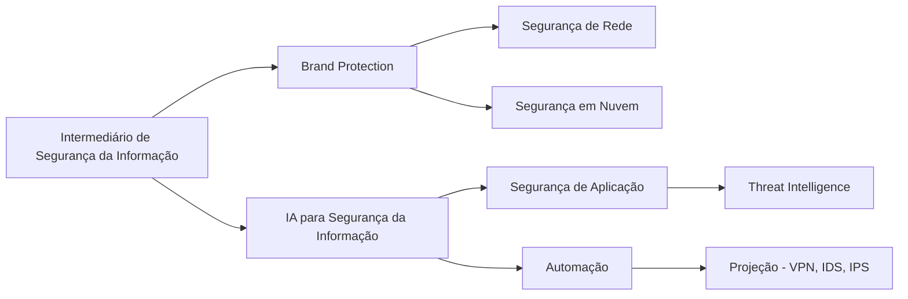

<h1 align="center">Intermedário de Segurança da Informação

## Bem-vindo(a) a continuação dessa jornada em Segurança da Informação!
&nbsp;&nbsp;&nbsp;&nbsp;Agora que você possui uma base sólida de conhecimento, é hora de avançar para a próxima etapa, focando nas ferramentas, configurações e implementações práticas essenciais para a segurança da informação. Neste módulo, você aprenderá a aplicar conceitos como proteção de marca, IA para segurança da informação, segurança de rede, segurança em nuvem, segurança de aplicação, automação, VPN, IDS, IPS e inteligência contra ameaças, que são amplamente utilizados no mercado.  
&nbsp;&nbsp;&nbsp;&nbsp;Após concluir os cursos, você terá acesso a PDFs com exercícios para reforçar seu aprendizado, agora esses novos desafios já são CTFs. Esses desafios são fundamentais para consolidar as habilidades adquiridas e preparar você para situações reais. Siga a sequência de cursos recomendada abaixo e, em caso de dúvidas, participe de nosso servidor no Discord. Dedique-se ao máximo e aproveite essa oportunidade para aprimorar suas habilidades na área de segurança cibernética.

## Intermediário:

1. **Brand Protection (Proteção de Marca)**  
   **Guia sobre Proteção de Marca e Defesa Digital | SOCRadar Academy**  
   [SOCRadar - Brand Protection Guide](https://academy.socradar.io/courses/brand-protection/)

2. **IA para Segurança da Informação**  
   **AI in Cybersecurity | Coursera**  
   [AI in Cybersecurity - Coursera](https://www.coursera.org/learn/ai-security)

   **Ou**  
   **Cybersecurity and AI | edX - IBM**  
   [IBM Cybersecurity and AI](https://www.edx.org/course/cybersecurity-and-ai)

3. **Segurança de Rede**  
   **Network Security | TryHackMe**  
   [TryHackMe Network Security](https://tryhackme.com/module/network-security)

   **Ou**  
   **Network Fundamentals | Hack The Box Academy**  
   [HTB Academy - Network Fundamentals](https://academy.hackthebox.com/module/preview/17)

4. **Segurança em Nuvem**  
   **Cloud Security Basics | TryHackMe**  
   [TryHackMe - Cloud Security](https://tryhackme.com/module/cloud-security)

   **Ou**  
   **Azure Security Engineer Path | Hack The Box Academy**  
   [HTB Academy - Azure Security](https://academy.hackthebox.com/path/preview/14)

5. **Segurança de Aplicação**  
   **OWASP Top 10 | TryHackMe**  
   [TryHackMe OWASP Top 10](https://tryhackme.com/module/owasp-top-10)

   **Ou**  
   **Web Fundamentals | Hack The Box Academy**  
   [HTB Academy - Web Fundamentals](https://academy.hackthebox.com/module/preview/23)

6. **Automação em Segurança**  
   **Let'sDefend – SOC Automation Labs**  
   [Let'sDefend SOC Labs](https://app.letsdefend.io/labs)

   **Ou**  
   **Blue Team Automation | Medium Playlist**  
   [Blue Team Automation Collection](https://infosecwriteups.com/blue-team-automation-collection-c37c5b3c8dbb)

7. **Projeção - VPN, IDS, IPS**  
   **Defensive Security | TryHackMe**  
   [TryHackMe Defensive Security](https://tryhackme.com/module/defensive-security)

   **Ou**  
   **Network Security Monitoring | HTB Academy**  
   [HTB Academy - NSM](https://academy.hackthebox.com/module/preview/91)

8. **Threat Intelligence (Inteligência contra Ameaças)**  
   **Threat Intelligence Learning Path | Let'sDefend**  
   [Let'sDefend Threat Intelligence Path](https://app.letsdefend.io/path/threat-intelligence)

   **Ou**  
   **Cyber Threat Intelligence | TryHackMe**  
   [TryHackMe Threat Intel](https://tryhackme.com/module/cyber-threat-intelligence)

---

## O que você deve saber ao terminar essa trilha:

- **Brand Protection (Proteção de Marca):**  
   Compreensão de como proteger a marca contra fraudes digitais, phishing e outras ameaças que afetam a identidade online e a reputação da empresa.
- **IA para Segurança da Informação:**  
   Capacidade de usar ferramentas de IA para monitorar, identificar e responder a incidentes de segurança em tempo real, além de implementar soluções baseadas em aprendizado de máquina.
- **Segurança de Rede:**  
   Habilidade para proteger redes contra ataques externos e internos, utilizando firewalls, IDS, IPS e técnicas de segmentação para manter a integridade e disponibilidade dos sistemas.
- **Segurança em Nuvem:**  
   Conhecimento sobre as melhores práticas de segurança em ambientes de nuvem, incluindo o uso de criptografia, autenticação multifatorial e monitoramento de acessos.
- **Segurança de Aplicação:**  
   Capacidade de proteger aplicações web e móveis contra ataques comuns como injeção SQL, XSS e CSRF, além de implementar práticas seguras de codificação.
- **Automação em Segurança:**  
   Habilidade para usar ferramentas e scripts para automatizar a detecção e resposta a incidentes, aumentando a eficiência e reduzindo erros humanos.
- **Projeção - VPN, IDS, IPS:**  
   Capacidade de configurar e gerenciar redes seguras usando VPNs, e sistemas IDS/IPS para identificar e prevenir intrusões em tempo real.
- **Threat Intelligence:**  
   Capacidade de coletar, analisar e compartilhar informações sobre ameaças emergentes, ajudando a antecipar e mitigar riscos antes que se concretizem.

---

## Profissões
&nbsp;&nbsp;&nbsp;&nbsp;Com os conhecimentos adquiridos até o final dessa trilha, você terá uma excelente base para seguir nas carreiras de:

- Analista de Segurança de Redes  
- Profissional de Inteligência contra Ameaças (Threat Intelligence)  
- Especialista em Segurança em Nuvem  
- Analista de Segurança de Aplicações  
- Engenheiro de Automação de Segurança

---

## Livros

**Brand Protection - Protecting Your Brand in the Digital Age**  
↳ [Link para compra na Amazon](https://www.amazon.com.br/Protecting-Your-Brand-Digital-Age/dp/1119203285)

**IA para Segurança da Informação - Artificial Intelligence for Cybersecurity**  
↳ [Link para compra na Amazon](https://www.amazon.com.br/Artificial-Intelligence-Cybersecurity-Strategies-Protecting/dp/0367336764)

**Segurança de Rede - Network Security Essentials**  
↳ [Link para compra na Amazon](https://www.amazon.com.br/Network-Security-Essentials-Applications-Protocols/dp/0131873167)

**Segurança em Nuvem - Cloud Security and Privacy**  
↳ [Link para compra na Amazon](https://www.amazon.com.br/Cloud-Security-Privacy-Practical-Approach/dp/0596151483)

**Segurança de Aplicação - Web Application Security: A Beginner’s Guide**  
↳ [Link para compra na Amazon](https://www.amazon.com.br/Web-Application-Security-Beginners-Guide/dp/0071790109)

**Automação em Segurança - Security Automation Essentials**  
↳ [Link para compra na Amazon](https://www.amazon.com.br/Security-Automation-Essentials-Practical-Implementations/dp/1118532319)

**Projeção - VPN, IDS, IPS - VPNs, IDS, IPS: Proteção Avançada**  
↳ [Link para compra na Amazon](https://www.amazon.com.br/VPNs-IDS-IPS-Network-Protection/dp/0137069777)

**Threat Intelligence - The Threat Intelligence Handbook**  
↳ [Link para compra na Amazon](https://www.amazon.com.br/Threat-Intelligence-Handbook-Defending-Businesses/dp/1119671045)

## Orientações Finais
&nbsp;&nbsp;&nbsp;&nbsp;Após concluir os cursos, não deixe de realizar os exercícios. Agora estamos avançando para desafios de CTFs (Capture The Flag). Se você tem interesse em participar de grupo para realizar CTFs ou estudos, cadastre-se em nosso site e em seguida, participe de um dos CTFs ou do laboratório do módulo anterior. Após concluir, publique sobre sua experiência e marque a @Hive.connect no LinkedIn. Assim, iremos atribuir um cargo específico para você e garantir sua entrada no fórum exclusivo de Segurança da Informação.Temos diversas atividades em grupo focadas na área de Segurança da Informação, além de oferecer mentoria 1:1 e consultoria gratuita para currículos e perfis no LinkedIn.
&nbsp;&nbsp;&nbsp;&nbsp;Esta foi uma introdução essencial ao tema, que servirá como base para os próximos módulos. No próximo, vamos explorar ferramentas que ajudarão a aplicar esses conceitos na prática e aprimorar suas habilidades na área. Sempre compartilhe seus novos certificados no LinkedIn para aumentar sua visibilidade e destacar seu desenvolvimento profissional.  

---  

## Vamos juntos fortalecer o conhecimento, Hive.Connect uma comunidade de todos, para todos!
