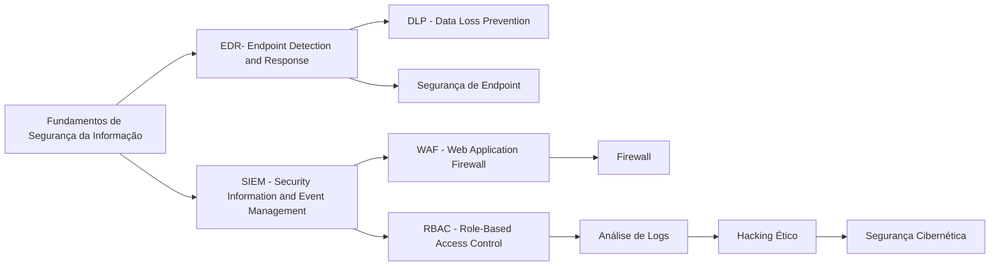
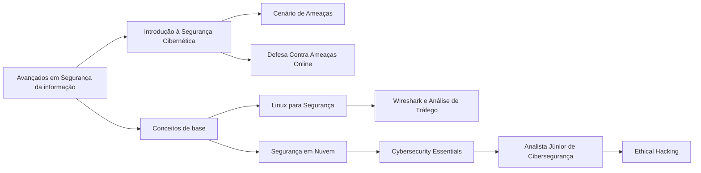

<h1 align="center">HIVE.CONNECT</h1>

<div align="center">
  
  <h1 align="center">Segurança da Informação</h1>
</div>

## Aviso 
&nbsp;&nbsp;&nbsp;&nbsp;Antes de começarmos, é fundamental que você tenha uma boa base em redes e programação. Recomendamos concluir as trilhas de programação e redes até o nível intermediário, pois muitos conceitos abordados aqui serão essenciais para o aprendizado.
Outro ponto importante: a trilha de Segurança da Informação é a única em que não conseguimos priorizar conteúdos gratuitos e em português. A maioria dos cursos nessa área são pagos e geralmente em dólar e grande parte do material está disponível apenas em inglês.
Por isso, indicamos essa trilha para quem já atua no mercado de tecnologia e deseja migrar para segurança ou para aqueles que têm alta disponibilidade de tempo e recursos para investir nos estudos. Muitos profissionais de Segurança da Informação vêm de áreas como Infraestrutura e Suporte, pois o conhecimento adquirido nessas funções ajudará muito nessa jornada!.

## Objetivo

&nbsp;&nbsp;&nbsp;&nbsp;O objetivo desta trilha é te capacitar para atuar na área de Segurança da Informação, saindo do completo zero e desenvolvendo habilidades para:  

→ **Identificar, mitigar e responder a ameaças cibernéticas**;  
→ **Implementar políticas de segurança para proteger redes, sistemas e dados**;  
→ **Realizar testes de invasão e auditoria de segurança em ambientes corporativos**  

## Perfil de um Profissional em Segurança da Informação
&nbsp;&nbsp;&nbsp;&nbsp;Quem trabalha com Segurança da Informação precisa ser analítico, atento aos detalhes e proativo, pois lida diretamente com a proteção de dados e a mitigação de ameaças. Além disso, a capacidade de resolver problemas sob pressão é essencial.
Algumas áreas da segurança da informação lidam com situações críticas e emergenciais. Muitas vezes, o profissional precisa estar disponível a qualquer momento para monitorar incidentes e responder a ataques, garantindo a continuidade dos sistemas e minimizando impactos para a empresa. Além disso, deve ter **pensamento crítico e agir rapidamente** diante de incidentes, garantindo a integridade, confidencialidade e disponibilidade das informações.  
  
  Principais Características:

- **Pensamento Analítico:** Identifica vulnerabilidades e antecipa possíveis ataques.  
- **Disponibilidade:** Altíssima, muitas vezes atuando fora do horário comercial.  
- **Resiliência:** Lida com pressão, incidentes e emergências sem perder o controle.  
- **Atenção aos Detalhes:** Pequenas falhas podem abrir brechas de segurança  
- **Ética e Responsabilidade:** Lida com dados sensíveis e informações críticas, exigindo integridade absoluta.
- **Pensamento Estratégico:** Antecipar ameaças e estruturar defesas antes que um ataque aconteça.
- **Senso de Urgência:** Resolve incidentes rapidamente para evitar downtime.  
- **Capacidade de Resolução de Problemas:** Diagnostica e mitiga ameaças rapidamente.

## Habilidades Técnicas Importantes:
### Fundamentos de Segurança  
→ Gestão de Riscos e Compliance (ISO 27001, NIST, LGPD, GDPR)  
→ Criptografia e Certificados Digitais 

### Redes e Infraestrutura Segura  
→ Firewalls  
→ IDS/IPS, DLP e EDR  
→ Configuração Segura de Servidores** (Linux/Windows)  
→ Redes Seguras (VPNs, VLANs, Zero Trust, Wireshark)  

###  Análise de Vulnerabilidades 
→ Ferramentas: Nmap, wireshark, graylog, syslog  
→ Hardening de Sistemas  

### Monitoramento e Resposta a Incidentes  
→ SIEMs: Splunk, Wazuh, Elastic  
→ Forense Digital e Threat Intelligence  
→ Mitigação de Ataques    

### Automação e Scripting  
→ Python (Automação de segurança, análise de logs)  
→ Bash & PowerShell  

### Cloud Security  
→ AWS, Azure, GCP Security  
→ IAM (Identity and Access Management)  
→ Segurança de Contêineres (Docker, Kubernetes, DevSecOps)    

## Áreas principais:
- Analista de Segurança da informação  
- Analista de Cloud    
- SOC    
- Threat Intelligence    
- Engenheiro de Segurança cibernética    
- Pesquisador Segurança da informação    
- Arquiteto Segurança da informação    
- Forense Digital    
- Especialista    
- Cybersecurity    
↳*Redteam*  
↳*Blueteam*  
↳*Orangeteam*  
↳*Whiteteam*

## Título para LinkedIn:

Segurança da Informação | SOC | Análise de Vulnerabilidades | SIEM | Certificação CompTIA Security+ em andamento    
<br>  
Cybersecurity | Blue Team | Monitoramento e Resposta a Incidentes | Splunk | MITRE ATT&CK | Certificação CySA+  
<br>  
Cloud Security | Segurança em AWS & Azure | IAM | Zero Trust | DevSecOps | Certificação AWS Security Specialty | AZ-500    
<br>  
Red Team | Ethical Hacking | Pentest | Exploits e Vulnerabilidades | Burp Suite | Certificação OSCP em andamento    
<br>  
Arquitetura de Segurança | Proteção de Infraestruturas Críticas | Modelagem de Ameaças | Zero Trust | CISSP | CCSP   

- **Esses são apenas alguns exemplos. Você pode criar o seu título personalizado seguindo a mesma estrutura: escolha a área que deseja atuar, destaque uma especialização dentro dessa área, inclua uma ferramenta importante relacionada e mencione uma certificação que está em processo de obtenção. Essa abordagem é chave para o sucesso.**

---
## Links Importantes para segurança da informação  

| Categoria | Nome | Descrição | Link | 
| :---: | :---: | :---: |  :---: | 
| **Mapa de Ataque** | Kaspersky Cyberthreat Real-Time Map | Mapa em tempo real que mostra a origem e o destino de ciberataques ao redor do mundo | [Kaspersky Map](https://cybermap.kaspersky.com/) |
| **Mapa de Ataque** | Bitdefender Threat Map | Exibe em tempo real a localização e origem de ataques cibernéticos, com dados sobre ameaças globais | [Bitdefender Map](https://threatmap.bitdefender.com/?adobe_mc=MCMID%3D49000288476365260246618629159961307977%7CMCORGID%3D0E920C0F53DA9E9B0A490D45%2540AdobeOrg%7CTS%3D1738627201) |
| **Notícias** | Caverna Tech | Em site com notícias focadas em tecnologia e segurança cibernética em Português | [Caveira Tech](https://caveiratech.com/) |
| **Notícias** | The Hacker News | Portal de notícias com atualizações sobre vulnerabilidades e incidentes | [The Hacker News](https://thehackernews.com/) |
| **Notícias** | TBleeping Computer | Oferece notícias diárias sobre cibersegurança, hacks e vulnerabilidades | [Bleeping Computer](https://www.bleepingcomputer.com/) |
| **Ferramenta Web** | VirusTotal | Analisa arquivos e URLs em busca de vírus, malware e outras ameaças | [Virus Total](https://www.virustotal.com/gui/home/upload) |
| **Ferramenta Web** | CyberChef  | Análise de dados e manipulação de texto, ideal para profissionais de segurança | [CyberChef](https://toolbox.itsec.tamu.edu/) |
| **Ferramenta Web** | Shodan | Um motor de busca para dispositivos IoT que ajuda a identificar vulnerabilidades | [Shodan](https://www.shodan.io/) |
| **Ferramenta Web** | Censys | Motor de busca de segurança para monitoramento de redes e serviços expostos na internet| [Censys](https://search.censys.io/) |
| **Ferramenta Web** | Have I Been Pwned | Verifique se suas credenciais foram expostas em brechas de segurança conhecidas | [Have I Been Pwned](https://haveibeenpwned.com/) |
| **CVE** | CVE Details | Plataforma para pesquisa detalhada sobre CVEs | [CVE Details](https://www.cvedetails.com/) |
| **Vulnerabilidades** | Exploit Database |  Repositório de exploits conhecidos, atualizado com detalhes sobre CVEs e ataques | [Exploit DataBase](https://www.exploit-db.com/) |
| **Recursos de Pentest** | PentestTools | Para agrupar ferramentas, novidades e dicas para pentesters | [PentestTools](https://pentesttools.net/) |
| **Serviço** | Temp Mail | Serviço de e-mail temporário para proteger sua privacidade e evitar spam. | [Temp Mail](https://temp-mail.org/pt/) |
| **Repositório** | The Art of Hacking | Repositório com diversos materiais, ferramentas e recursos para cibersegurança | [h4cker](https://github.com/The-Art-of-Hacking/h4cker) |
| **Repositório** | OWASP Cheat Sheet Series | Coleção de cheatsheets para auxiliar a aplicar práticas de segurança | [OWASP Cheat Sheet Series](https://github.com/OWASP/CheatSheetSeries) |
| **Repositório** | Metasploit Framework | Plataforma avançada para desenvolvimento, teste e execução de exploits contra máquinas remotas. | [Metasploit Framework](https://github.com/rapid7/metasploit-framework) |
| **Repositório** | Awesome Security | Lista curada de recursos de segurança, incluindo livros, ferramentas e artigos. | [Awesome Security](https://github.com/sbilly/awesome-security) |
___
## O que você verá em cada módulo:</h1>
<h1 align="center">Fudamentos</h1>


<h1 align="center">Iniciante</h1>



<h1 align="center">Intermediário</h1>

```mermaid
    graph LR;
      graph LR;
    A[Intermediário de Segurança da Informação] --> B[Brand Protection];
    A --> C[IA para Segurança da Informação];
    B --> D[Segurança de Rede];
    B --> E[Segurança em Nuvem];
    C --> F[Segurança de Aplicação];
    C --> G[Automação];
    G --> H[Projeção - VPN, IDS, IPS];
    F --> I[Threat Intelligence];

      click A "https://github.com/socialhiveconnect/Seg.Info/tree/main/intermediario" "Veja o repositório Intermediário"
```

<h1 align="center">Avançado</h1>


---

<h1 align="center">Pós-Graduações</h1>

### USP (LARC)
- [MBA em Cibersegurança: Infraestrutura, Políticas e Gerenciamento (EAD)](https://cursos.larc.usp.br/mba-ciberseguranca/)

### Acadi-TI  
- [Pós-Graduação em Cibersegurança Acadi-TI + CEH](https://acaditi.com.br/pos-graduacao-em-ciberseguranca-ofensiva/)

### FIAP  
- [Offensive Cyber Security - Red Team Operations](https://postech.fiap.com.br/curso/offensive-cyber-security-red-team-ops/)  
- [Defensive Cyber Security - Blue Team Operations](https://postech.fiap.com.br/curso/defensive-cyber-security-blue-team-ops/)  
- [MBA em Cyber Security Governance & Management](https://www.fiap.com.br/mba/mba-em-cyber-security-governance-management/)

### PUCPR  
- [Pós-Graduação em Cibersegurança](https://www.pucpr.br/cursos-especializacao-e-mba/ciberseguranca/)  

### IBSEC  
- [Defesa Cibernética com Ênfase em Inteligência Artificial, Forense e Hacker Ético](https://ibsec.com.br/pos-graduacao/defesa-cibernetica-com-enfase-em-inteligencia-artificial-forense-e-hacker-etico/)

### FGV Educação Executiva
- [MBA em Cibersegurança](https://educacao-executiva.fgv.br/cursos/live/mba-live/mba-em-ciberseguranca)

### XP Educação
- [Pós-graduação em Segurança da Informação e Cibersegurança](https://www.xpeducacao.com.br/pos-graduacao/pos-seguranca-cibernetica)

### Anhanguera
- [MBA em Cybersecurity e Cybercrimes](https://www.posanhanguera.com.br/mba-em-cybersecurity-e-cybercrimes-anhanguera-ead-6-meses/p)

### Nova School of Business and Economics
- [Pós-Graduação Online em Gestão de Cibersegurança](https://www.novasbe.unl.pt/pt/cursos/formacao-de-executivos/programas-abertos/ia-data-e-digital/pos-graduacao-online-gestao-ciberseguranca)

### UNINASSAU
- [Especialização em Segurança Cibernética](https://posead.uninassau.edu.br/nossos-cursos/especializacao-em-seguranca-cibernetica/801/60/digital)

## Certificações
→ **CompTIA Security+** - Para quem está começando.  
→ **CEH** - Para quem quer se especializar em hacking ético.  
→ **GIAC Security Essentials (GSEC)** - Para uma abordagem prática.  
→ **CISSP** - Para uma carreira avançada em segurança (geralmente, após alguns anos de experiência).  
→ **CISM** - Para gerentes de segurança de TI.  
→ **CISA** - Para profissionais focados em auditoria e controle.  
→ **CCSP** - Para quem trabalha com segurança em nuvem.  
→ **GCIH** - Para especialistas em resposta a incidentes.  
→ **CTIA** - Para analistas de ameaças cibernéticas.  
→ **CDRE** - Para profissionais de continuidade de negócios e recuperação de desastres.  

---

<h1 align="center">Plataformas e Eventos de CTF</h1>

### Plataformas Online  
- [**Extreme Hacking**](https://extremehacking.com/) - Desafios avançados com foco em cibersegurança ofensiva, com uma comunidade ativa de hackers.  
- [**Hack The Box (HTB)**](https://www.hackthebox.com/) - Plataforma interativa para testar e aprimorar habilidades ofensivas e defensivas.  
- [**TryHackMe**](https://tryhackme.com/) - Oferece laboratórios interativos com aprendizado guiado.  
- [**OverTheWire**](https://overthewire.org/wargames/) - Desafios de segurança para aprender sobre Linux, redes e exploração.  
- [**PicoCTF**](https://picoctf.org/) - CTF voltado para iniciantes, criado pela Carnegie Mellon University.  
- [**Root Me**](https://www.root-me.org/) - Diversos desafios em várias categorias de segurança ofensiva.  
- [**Hack This Site**](https://www.hackthissite.org/) - Plataforma educacional com desafios realistas.  
- [**RingZer0 Team**](https://ringzer0ctf.com/) - Conjunto de desafios para testar habilidades técnicas.  
- [**Cryptopals**](https://cryptopals.com/) - Desafios voltados para criptografia e segurança.  
- [**Microcorruption**](https://microcorruption.com/) - CTF especializado em engenharia reversa.  

### Eventos e Competições  
- [**DEF CON CTF**](https://oooverflow.io/) - Uma das competições mais prestigiadas de CTF do mundo.  
- [**Google CTF**](https://capturetheflag.withgoogle.com/) - Evento anual da Google com desafios avançados.  
- [**Hack The Box CTF**](https://ctf.hackthebox.com/) - Competições promovidas pela HTB.  
- [**Redpwn CTF**](https://redpwn.net/) - CTF realizado anualmente, com foco educacional.  
- [**Cyber Apocalypse CTF (HTB)**](https://ctf.hackthebox.com/cyber-apocalypse) - CTF temático da Hack The Box.  
- [**PlaidCTF**](https://plaidctf.com/) - CTF organizado pela Plaid Parliament of Pwning (PPP).  
- [**FAUST CTF**](https://ctf.faust.ninja/) - Desafios criativos organizados pelo FAUST.  

### Recursos e Rankings  
- [**CTFTime**](https://ctftime.org/) - Lista de competições ativas e ranking global de times.  
- [**Red Team Village CTF**](https://redteamvillage.io/) - CTFs focados em Red Team e exploração ofensiva.  
- [**LiveOverflow YouTube**](https://www.youtube.com/c/LiveOverflow/) - Canal com vídeos sobre CTF e exploração.  
- [**PentesterLab**](https://pentesterlab.com/) - Recursos pagos e gratuitos para aprendizado.  
- [**Hacker101 CTF**](https://ctf.hacker101.com/) - CTF com desafios focados em web hacking.  
- [**WeChall**](https://www.wechall.net/) - Agrega desafios de várias plataformas para ranking global.  

 Termine uma das trilhas e marque a Hive.Connect no linkedin para ganhar acesso ao forúm exclusivo de Segurança da Informação e fazer CTFs em grupo, Análise de Malware, entre outros estudos. 

---

## Canais no YouTube sobre Segurança da Informação

- [HackerSploit](https://www.youtube.com/c/HackerSploit)  
  Hacking ético, testes de penetração, análise de vulnerabilidades e outras áreas de segurança da informação.

- [The Cyber Mentor](https://www.youtube.com/c/TheCyberMentor)  
  Hacking ético, pentesting e segurança em redes, com muitos tutoriais e dicas práticas.

- [LiveOverflow](https://www.youtube.com/c/LiveOverflow)  
  Hacking, CTFs (Capture The Flag), e técnicas de segurança em sistemas e redes.

- [NetworkChuck](https://www.youtube.com/c/NetworkChuck)  
  Abordagem acessível sobre redes, segurança cibernética, hacking ético e outras áreas da TI.

- [Computerphile](https://www.youtube.com/c/Computerphile)  
  Explicações detalhadas sobre conceitos de segurança, criptografia, hacking e ciências computacionais.

- [David Bombal](https://www.youtube.com/c/DavidBombal)  
  Redes, segurança de TI, hacking ético e exames de certificação como CCNA e CompTIA.

- [IppSec](https://www.youtube.com/c/IppSec)  
  Resolver CTFs e hacks em ambientes de segurança, com explicações detalhadas sobre a execução dos ataques.

- [SecPro](https://www.youtube.com/c/SecPro)  
  Tutoriais de hacking ético, análise de segurança e vulnerabilidades em sistemas e redes.

- [Null Byte](https://www.youtube.com/c/NullByteWHT)  
  Hacking ético, tutoriais de pentesting, segurança em redes e ferramentas usadas em segurança cibernética.

- [Hak5](https://www.youtube.com/c/Hak5Darren)  
  Segurança de redes, hacking, pentesting e hacking em hardware, além de notícias de segurança.

- [Professor Messer](https://www.youtube.com/c/ProfessorMesser)  
  Focado em certificações de TI e segurança da informação, como CompTIA A+, Network+ e Security+.

- [John Hammond](https://www.youtube.com/c/JohnHammond010)  
  Segurança ofensiva, pentesting e desafios de segurança como CTFs, com explicações detalhadas sobre técnicas de ataque.

- [PentesterLab](https://www.youtube.com/c/PentesterLab)  
  Treinamento prático de segurança ofensiva, com tutoriais sobre como encontrar e explorar vulnerabilidades.

- [Black Hills Information Security](https://www.youtube.com/c/BlackHillsInformationSecurity)  
 Webinars e apresentações sobre segurança de TI, pentesting e testes de invasão, com análises profundas e discussão sobre técnicas avançadas.

- [SANS Institute](https://www.youtube.com/c/SANSInstitute)  
 Fornece conteúdo educacional de alta qualidade sobre segurança cibernética, incluindo webinars e tutoriais práticos.

- [Cyber Security Awareness](https://www.youtube.com/c/CyberSecurityAwareness)  
 Foco em conscientização de segurança cibernética, com dicas práticas sobre como proteger dados e dispositivos contra ameaças.

- [TechSavy Solutions](https://www.youtube.com/c/TechSavySolutions)  
  Conteúdo educacional sobre segurança de redes, hacking ético e análise de vulnerabilidades.

- [The IT Support Center](https://www.youtube.com/c/TheITSupportCenter)  
  Fornece tutoriais sobre segurança da informação, técnicas de hacking e como proteger redes e sistemas de TI.

- [CyberSecTuts](https://www.youtube.com/c/CyberSecTuts)  
 Hacking ético, pentesting e ferramentas de segurança cibernética, abordando temas como vulnerabilidades e ataques.

- [Techno Tim](https://www.youtube.com/c/TechnoTim)  
  Canal que cobre tópicos sobre segurança em redes, monitoramento de segurança e boas práticas para proteger sistemas de TI.

---

## Principais Ferramentas Instaláveis

| Categoria | Nome | Open Source/Paga | Descrição | Link |
| :---: | :---: | :---: | :---: | :---: |
| **Análise de Redes** | **Nmap** | Open Source | Ferramenta para descoberta de rede e auditoria de segurança, utilizada para mapear redes e identificar portas abertas. | [Nmap](https://nmap.org/) |
| **SIEM** | **AlienVault OSSIM** | Open Source | Plataforma de gerenciamento de eventos e informações de segurança que integra diversas ferramentas de segurança. | [AlienVault OSSIM](https://cybersecurity.att.com/products/ossim) |
| **Análise de Vulnerabilidades** | **Nessus** | Paga | Scanner de vulnerabilidades amplamente utilizado para identificar pontos fracos em sistemas e redes. | [Nessus](https://www.tenable.com/products/nessus) |
| **Compartilhamento de Informações** | **MISP** | Open Source | Plataforma de compartilhamento de informações sobre ameaças, facilitando a coleta, armazenamento e distribuição de indicadores de comprometimento. | [MISP](https://www.misp-project.org/) |
| **Análise de Vulnerabilidades** | **OpenVAS** | Open Source | Plataforma robusta para varreduras de vulnerabilidades, permitindo a detecção de falhas de segurança em diversos serviços e aplicações. | [OpenVAS](https://www.greenbone.net/en/openvas-community-edition/) |
| **Detecção de Intrusões** | **Snort** | Open Source | Sistema de prevenção e detecção de intrusões em rede que analisa o tráfego em tempo real. | [Snort](https://www.snort.org/) |
| **Monitoramento de Segurança** | **Wazuh** | Open Source | Plataforma de monitoramento de segurança que oferece detecção de ameaças, integridade de arquivos e resposta a incidentes. | [Wazuh](https://wazuh.com/) |
| **Análise de Redes** | **Wireshark** | Open Source | Ferramenta de análise de protocolos de rede que captura e interage com os dados trafegados em uma rede. | [Wireshark](https://www.wireshark.org/) |
| **Firewall** | **Untangle** | Open Source | Fornece proteção contra spam, vírus e spyware, além de filtragem na web e funcionalidades de firewall. | [Untangle](https://www.untangle.com/) |
| **Monitoramento de Redes** | **Network Security Toolkit (NST)** | Open Source | Combina uma variedade de aplicativos de código aberto para monitorar tráfego, intrusões e muito mais. | [NST](https://networksecuritytoolkit.org/nst/) |
| **Auditoria de Segurança** | **Bastille Linux** | Open Source | Ferramenta que oferece um bloqueio personalizado para máquinas Linux, baseado em respostas sobre segurança. | [Bastille Linux](https://bastille-linux.sourceforge.io/) |
| **Análise de Malware** | **Cuckoo Sandbox** | Open Source | Sistema de análise automatizada de malware que permite a observação do comportamento de arquivos suspeitos. | [Cuckoo Sandbox](https://cuckoosandbox.org/) |
| **Forense Digital** | **Autopsy** | Open Source | Interface gráfica para o The Sleuth Kit, utilizada para investigações forenses de discos rígidos e smartphones. | [Autopsy](https://www.sleuthkit.org/autopsy/) |
| **Kali Linux**                    | **Aircrack-ng**           | Open Source     | Conjunto de ferramentas para testar a segurança de redes sem fio, incluindo crack de chaves WEP e WPA. | [Aircrack-ng](https://www.aircrack-ng.org/) |
| **Kali Linux**                    | **Burp Suite**            | Paga            | Plataforma para realizar testes de penetração em aplicativos web, com foco em interceptação de requisições HTTP/HTTPS. | [Burp Suite](https://portswigger.net/burp) |
| **Kali Linux**                    | **Metasploit Framework**  | Open Source/Paga | Ferramenta de desenvolvimento e execução de exploits contra máquinas remotas. | [Metasploit](https://www.metasploit.com/) |
| **Kali Linux**                    | **John the Ripper**       | Open Source     | Ferramenta para quebra de senhas, com suporte a diversos algoritmos de criptografia. | [John the Ripper](https://www.openwall.com/john/) |
| **Kali Linux**                    | **Hydra**                 | Open Source     | Ferramenta para ataques de força bruta em serviços de rede, como SSH, FTP, HTTP, entre outros. | [Hydra](https://github.com/vanhauser-thc/thc-hydra) |
| **Kali Linux**                    | **Wireshark**             | Open Source     | Ferramenta de análise de protocolos de rede, permitindo capturar e examinar pacotes de dados em tempo real. | [Wireshark](https://www.wireshark.org/) |
| **Forense Digital**               | **Sleuth Kit**            | Open Source     | Conjunto de ferramentas para investigação forense digital de sistemas de arquivos, adequado para análise de discos e dispositivos. | [Sleuth Kit](https://www.sleuthkit.org/) |
| **Análise de Malware**            | **Cuckoo Sandbox**        | Open Source     | Ferramenta de análise automatizada de malware, permitindo a execução segura e o monitoramento de arquivos suspeitos. | [Cuckoo Sandbox](https://cuckoosandbox.org/) |
| **Monitoramento de Rede**         | **Zabbix**                | Open Source     | Ferramenta de monitoramento de redes, servidores e aplicações, proporcionando análise detalhada de desempenho e segurança. | [Zabbix](https://www.zabbix.com/) |
| **Teste de Penetração**           | **OWASP ZAP**             | Open Source     | Ferramenta de teste de penetração focada em encontrar vulnerabilidades em aplicativos web. | [OWASP ZAP](https://www.zaproxy.org/) |
| **Segurança de Email**            | **Gpg4win**               | Open Source     | Ferramenta para criptografia e assinatura de emails, usando o padrão OpenPGP. | [Gpg4win](https://gpg4win.org/) |
| **Gerenciamento de Vulnerabilidades** | **OpenSCAP**             | Open Source     | Conjunto de ferramentas para avaliação de segurança de sistemas, com foco em conformidade e análise de vulnerabilidades. | [OpenSCAP](https://www.open-scap.org/) |
| **Análise de Vulnerabilidades**   | **Nikto**                 | Open Source     | Scanner de vulnerabilidades em servidores web, verificando configurações inseguras e possíveis falhas. | [Nikto](https://cirt.net/Nikto2) |
| **Segurança de Banco de Dados**   | **sqlmap**                | Open Source     | Ferramenta para automatizar a detecção e exploração de falhas de injeção SQL em aplicativos web. | [sqlmap](http://sqlmap.org/) |
| **Teste de Penetração**           | **Beef Framework**        | Open Source     | Framework para penetração em aplicativos web, focado em exploração de falhas em browsers. | [Beef Framework](https://github.com/beefproject/beef) |


<h1 align="center">Muito obrigada por chegar até aqui! 🐝</h1>

&nbsp;&nbsp;&nbsp;&nbsp;Se esse conteúdo foi útil para você, ficarei muito feliz se puder compartilhar com outras pessoas que também possam se beneficiar. A **Hive.Connect** é um espaço para aprendermos e crescermos juntos no universo da tecnologia e segurança, e cada contribuição de vocês faz toda a diferença! **compartilhe e ajude a comunidade a crescer**! Vamos continuar trocando conhecimento e fazendo a diferença no mundo de tecnologia!

---
**Vamos juntos fortalecer o conhecimento, Hive.Connect uma comunidade de todos, para todos!**  
