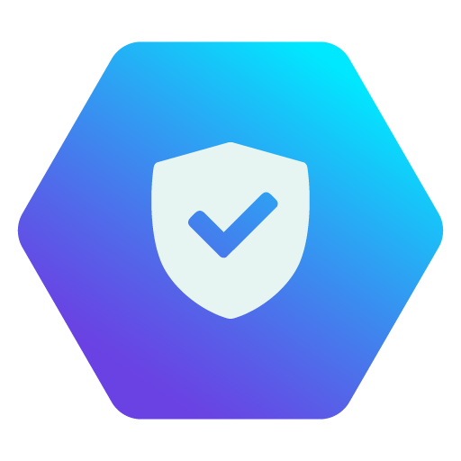

<h1 align="center">HIVE.CONNECT</h1>

  
  <h1 align="center">Segurança da Informação</h1>

## Aviso 
&nbsp;&nbsp;&nbsp;&nbsp;Antes de começarmos, é fundamental que você tenha uma boa base em redes e programação. Recomendamos concluir as trilhas de programação e redes até o nível intermediário, pois muitos conceitos abordados aqui serão essenciais para o aprendizado.
Outro ponto importante: a trilha de Segurança da Informação é a única em que não conseguimos priorizar conteúdos gratuitos e em português. A maioria dos cursos nessa área são pagos e geralmente em dólar e grande parte do material está disponível apenas em inglês.
Por isso, indicamos essa trilha para quem já atua no mercado de tecnologia e deseja migrar para segurança ou para aqueles que têm alta disponibilidade de tempo e recursos para investir nos estudos. Muitos profissionais de Segurança da Informação vêm de áreas como Infraestrutura e Suporte, pois o conhecimento adquirido nessas funções ajudará muito nessa jornada!.

## Objetivo

&nbsp;&nbsp;&nbsp;&nbsp;O objetivo desta trilha é te capacitar para atuar na área de Segurança da Informação, saindo do completo zero e desenvolvendo habilidades para:  

→ **Identificar, mitigar e responder a ameaças cibernéticas**;  
→ **Implementar políticas de segurança para proteger redes, sistemas e dados**;  
→ **Realizar testes de invasão e auditoria de segurança em ambientes corporativos**  

## Perfil de um Profissional em Segurança da Informação
&nbsp;&nbsp;&nbsp;&nbsp;Quem trabalha com Segurança da Informação precisa ser analítico, atento aos detalhes e proativo, pois lida diretamente com a proteção de dados e a mitigação de ameaças. Além disso, a capacidade de resolver problemas sob pressão é essencial.
Algumas áreas da segurança da informação lidam com situações críticas e emergenciais. Muitas vezes, o profissional precisa estar disponível a qualquer momento para monitorar incidentes e responder a ataques, garantindo a continuidade dos sistemas e minimizando impactos para a empresa. Além disso, deve ter **pensamento crítico e agir rapidamente** diante de incidentes, garantindo a integridade, confidencialidade e disponibilidade das informações.  
  
  Principais Características:

- **Pensamento Analítico:** Identifica vulnerabilidades e antecipa possíveis ataques.  
- **Disponibilidade:** Altíssima, muitas vezes atuando fora do horário comercial.  
- **Resiliência:** Lida com pressão, incidentes e emergências sem perder o controle.  
- **Atenção aos Detalhes:** Pequenas falhas podem abrir brechas de segurança  
- **Ética e Responsabilidade:** Lida com dados sensíveis e informações críticas, exigindo integridade absoluta.
- **Pensamento Estratégico:** Antecipar ameaças e estruturar defesas antes que um ataque aconteça.
- **Senso de Urgência:** Resolve incidentes rapidamente para evitar downtime.  
- **Capacidade de Resolução de Problemas:** Diagnostica e mitiga ameaças rapidamente.

## Habilidades Técnicas Importantes:
### Fundamentos de Segurança  
→ **Gestão de Riscos e Compliance** (ISO 27001, NIST, LGPD, GDPR)  
→ **Criptografia e Certificados Digitais** 

### Redes e Infraestrutura Segura  
→ **Firewalls e IDS/IPS**  
→ **Configuração Segura de Servidores** (Linux/Windows)  
→ **Redes Seguras (VPNs, VLANs, Zero Trust, Wireshark)** 

###  Análise de Vulnerabilidades 
→ **Ferramentas:** Nmap, wireshark, graylog, syslog  
→ **Hardening de Sistemas**  

### Monitoramento e Resposta a Incidentes  
→ **SIEMs:** Splunk, Wazuh, Elastic  
→ **Forense Digital e Threat Intelligence**  
→ **Mitigação de Ataques**  

### Automação e Scripting  
→ **Python** (Automação de segurança, análise de logs)  
→ **Bash & PowerShell**  

### Cloud Security  
→ **AWS, Azure, GCP Security**  
→ **IAM (Identity and Access Management)**  
→ **Segurança de Contêineres (Docker, Kubernetes, DevSecOps)**  

## Áreas principais:
- **Analista de Segurança da informação*  
- **Analista de Cloud**  
- **SOC**  
- **Threat Intelligence**  
- **Engenheiro de Segurança cibernética**  
- **Pesquisador Segurança da informação**  
- **Arquiteto Segurança da informação**  
- **Forense Digital**  
- **Especialista**  
- **Cybersecurity**  
↳**Redteam**  
↳**Blueteam**  
↳**Orangeteam**  
↳**Whiteteam**  
---
**Vamos juntos fortalecer o conhecimento, Hive.Connect uma comunidade de todos, para todos!**  
