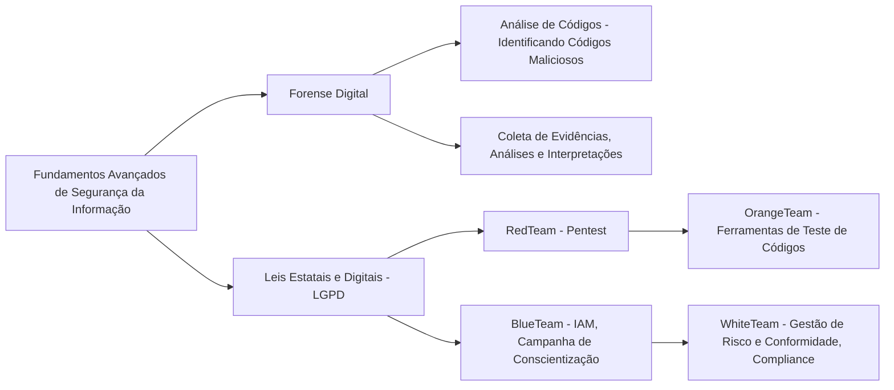

<h1 align="center">Avançado em Segurança da Informação

## Bem-vindo(a) ao módulo avançado da jornada em Segurança da Informação!  
&nbsp;&nbsp;&nbsp;&nbsp;Agora que você já possui uma base sólida de conhecimento em segurança da informação, é hora de avançar para o módulo mais avançado, focando em áreas complexas e práticas essenciais para enfrentar os desafios modernos de cibersegurança. Neste módulo, você aprenderá a aplicar conceitos como forense digital, leis digitais (como a LGPD), análise de códigos maliciosos, coleta e interpretação de evidências, além de entender as funções de diferentes equipes de segurança, como o RedTeam, BlueTeam, OrangeTeam e WhiteTeam.  
&nbsp;&nbsp;&nbsp;&nbsp;Após concluir os cursos, você terá acesso a PDFs com exercícios para reforçar seu aprendizado, agora esses novos desafios já são CTFs. Esses desafios são fundamentais para consolidar as habilidades adquiridas e preparar você para situações reais. Siga a sequência de cursos recomendada abaixo e, em caso de dúvidas, participe de nosso servidor no Discord. Dedique-se ao máximo e aproveite essa oportunidade para aprimorar suas habilidades na área de segurança cibernética.

---

## Avançado:

**1. **Forense Digital**  
   **Introdução à Forense Digital | Udemy**  
   [Curso Forense Digital](https://www.udemy.com/course/digital-forensics-foundations/)

   **Ou**  
   **Digital Forensics and Incident Response | Cybrary**  
   [Curso de Forense Digital](https://www.cybrary.it/course/digital-forensics-and-incident-response/)

   **Ou**  
   **Forense Computacional – Teoria e Prática | Academia Forense Digital**  
   [Curso de Forense Computacional](https://www.academiaforensedigital.com.br/curso/forense-computacional)

2. **Leis Estatais e Digitais, incluindo LGPD e outras leis relacionadas ao ciberespaço**  
   **LGPD e Privacidade de Dados | Udemy**  
   [Curso de LGPD](https://www.udemy.com/course/lgpd-lei-geral-de-protecao-de-dados-pessoais/)

   **Ou**  
   **Cybersecurity Laws and Compliance | Coursera**  
   [Curso de Cibersegurança e Conformidade](https://www.coursera.org/learn/cybersecurity-laws)

   **Ou**  
   **Introdução à LGPD para Peritos | Academia Forense Digital**  
   [Curso de LGPD na Prática Forense](https://www.academiaforensedigital.com.br/curso/lgpd)

3. **Análise de Códigos - Identificando Códigos Maliciosos**  
   **Curso de Análise de Malware | Udemy**  
   [Curso de Análise de Malware](https://www.udemy.com/course/malware-analysis/)

   **Ou**  
   **Static and Dynamic Analysis of Malware | Cybrary**  
   [Análise Estática e Dinâmica de Malware](https://www.cybrary.it/course/malware-analysis/)

   **Ou**  
   **Introdução à Engenharia Reversa e Malware | Academia Forense Digital**  
   [Curso de Engenharia Reversa](https://www.academiaforensedigital.com.br/curso/malware)

4. **Coleta de Evidências, Análises e Interpretações**  
   **Coleta e Análise de Evidências | Cybrary**  
   [Curso de Coleta de Evidências](https://www.cybrary.it/course/evidence-collection/)

   **Ou**  
   **Evidência Digital e Forense | Udemy**  
   [Curso de Evidência Forense](https://www.udemy.com/course/digital-evidence-collection-forensics/)

   **Ou**  
   **Coleta e Preservação de Evidências Digitais | Academia Forense Digital**  
   [Curso de Preservação de Evidências](https://www.academiaforensedigital.com.br/curso/coleta-evidencias-digitais)

5. **Cybersecurity - RedTeam, BlueTeam, OrangeTeam, WhiteTeam**  
   **RedTeam (Pentest - Todos os Tipos)**  
   **Introdução ao PenTest e RedTeam | Udemy**  
   [Curso de PenTest](https://www.udemy.com/course/ethical-hacking-the-complete-course/)

   **Ou**  

   **Hack the Box – Starting Point | HackTheBox Academy**  
   [HTB Starting Point](https://academy.hackthebox.com/track/starting-point)

   **Ou** 
 
   **Pentest Essentials | TryHackMe**  
   [Pentest Essentials no TryHackMe](https://tryhackme.com/room/pentestessentials)

   **Ou**  

   **BlueTeam (IAM, Campanha de Conscientização)**  
   **Gestão de Identidades e Acessos (IAM) | Coursera**  
   [Curso IAM](https://www.coursera.org/learn/identity-access-management)

   **Ou**  

   **OrangeTeam (Ferramentas de Teste de Códigos)**  
   **Testes de Vulnerabilidades em Códigos | Udemy**  
   [Curso de Testes de Vulnerabilidades](https://www.udemy.com/course/penetration-testing-vulnerabilities/)

   **Ou**  

   **Secure Coding | Hack The Box Academy**  
   [HTB Secure Coding](https://academy.hackthebox.com/course/preview/secure-coding)

   **WhiteTeam (Gestão de Risco e Conformidade, Parte Legal, Compliance)**  
   **Gestão de Riscos e Compliance | Coursera**  
   [Curso de Compliance e Gestão de Riscos](https://www.coursera.org/learn/risk-management-compliance)

   **Ou**  

   **Governança, Riscos e Conformidade na Prática | Academia Forense Digital**  
   [Curso de GRC](https://www.academiaforensedigital.com.br/curso/governanca-riscos-conformidade)

---

## O que você deve saber ao terminar essa trilha:

- **Forense Digital:**  
   Capacidade de realizar investigações forenses, identificar rastros digitais e coletar evidências que podem ser usadas para investigar incidentes de segurança.
- **Leis Estatais e Digitais, incluindo LGPD:**  
   Compreensão das principais leis relacionadas à segurança da informação, como a LGPD, e como elas impactam a coleta de dados, proteção de informações pessoais e o cumprimento de normas.
- **Análise de Códigos - Identificando Códigos Maliciosos:**  
   Habilidade para analisar códigos maliciosos usando técnicas de análise estática e dinâmica para detectar vulnerabilidades, malwares e comportamentos suspeitos.
- **Coleta de Evidências, Análises e Interpretações:**  
   Capacidade de realizar a coleta e análise de evidências digitais de maneira correta, interpretando os dados encontrados para fornecer resultados precisos durante uma investigação.
- **Cybersecurity Teams - Red, Blue, Orange, White Teams:**  
   Entendimento dos papéis de cada time em um ambiente corporativo de segurança:
   - **RedTeam:** Realiza testes de penetração e ataques simulados para identificar vulnerabilidades.
   - **BlueTeam:** Foca na defesa da infraestrutura, usando práticas de IAM e conscientização dos colaboradores.
   - **OrangeTeam:** Testa códigos e aplicações para identificar falhas de segurança.
   - **WhiteTeam:** Responsável por gerenciar os riscos, garantir a conformidade legal e implementar políticas de segurança e privacidade.

---

## Profissões  
Com os conhecimentos adquiridos até o final dessa trilha, você terá uma excelente base para seguir nas carreiras de:

- Investigador Forense Digital  
- Especialista em Conformidade e Regulamentação  
- Analista de Cibersegurança (RedTeam, BlueTeam, OrangeTeam)  
- Consultor de Gestão de Riscos e Compliance

---

## Livros

**Forense Digital - Digital Forensics and Cyber Crime**  
↳ [Link para compra na Amazon](https://www.amazon.com.br/Digital-Forensics-Cyber-Crime-Principles/dp/0128030723)

**LGPD - A Lei Geral de Proteção de Dados Pessoais**  
↳ [Link para compra na Amazon](https://www.amazon.com.br/LGPD-Geral-Proteção-Dados-Pessoais/dp/6555527383)

**Análise de Malware - Practical Malware Analysis**  
↳ [Link para compra na Amazon](https://www.amazon.com.br/Practical-Malware-Analysis-Dissecting-Malicious/dp/1593272899)

**Evidências Digitais - Computer Forensics and Digital Investigation**  
↳ [Link para compra na Amazon](https://www.amazon.com.br/Computer-Forensics-Digital-Investigation-Miller/dp/0367335326)

**RedTeam - The Web Application Hacker's Handbook**  
↳ [Link para compra na Amazon](https://www.amazon.com.br/Web-Application-Hackers-Handbook-Exploiting/dp/1118026470)

**BlueTeam - Security Operations Center: A Guide to the Cybersecurity Operations Center**  
↳ [Link para compra na Amazon](https://www.amazon.com.br/Security-Operations-Center-Cybersecurity/dp/012805201X)

**WhiteTeam - Cybersecurity and Cyberwar: What Everyone Needs to Know**  
↳ [Link para compra na Amazon](https://www.amazon.com.br/Cybersecurity-Cyberwar-Everyone-Needs-Know/dp/0199918098)

## Orientações Finais
&nbsp;&nbsp;&nbsp;&nbsp;Após concluir os cursos, não deixe de realizar os exercícios. Agora estamos avançando para desafios de CTFs (Capture The Flag). Se você tem interesse em participar de grupo para realizar CTFs ou estudos, cadastre-se em nosso site e em seguida, participe de um dos CTFs ou do laboratório do módulo anterior. Após concluir, publique sobre sua experiência e marque a @Hive.connect no LinkedIn. Assim, iremos atribuir um cargo específico para você e garantir sua entrada no fórum exclusivo de Segurança da Informação.Temos diversas atividades em grupo focadas na área de Segurança da Informação, além de oferecer mentoria 1:1 e consultoria gratuita para currículos e perfis no LinkedIn.
&nbsp;&nbsp;&nbsp;&nbsp;Esta foi uma introdução essencial ao tema, que servirá como base para os próximos módulos. No próximo, vamos explorar ferramentas que ajudarão a aplicar esses conceitos na prática e aprimorar suas habilidades na área. Sempre compartilhe seus novos certificados no LinkedIn para aumentar sua visibilidade e destacar seu desenvolvimento profissional.  

---  

## Vamos juntos fortalecer o conhecimento, Hive.Connect uma comunidade de todos, para todos!
