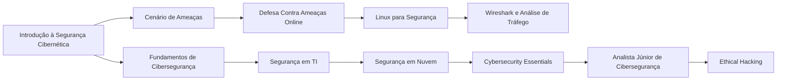
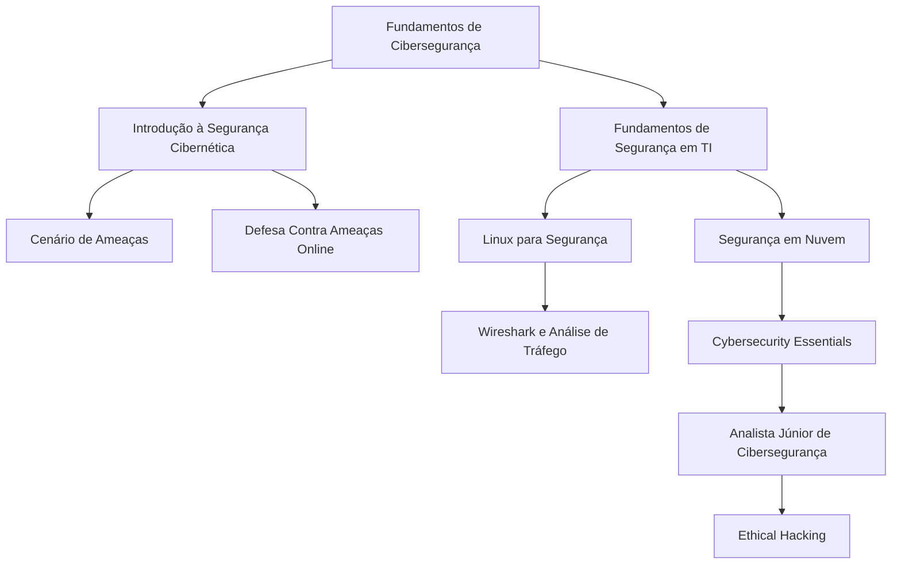
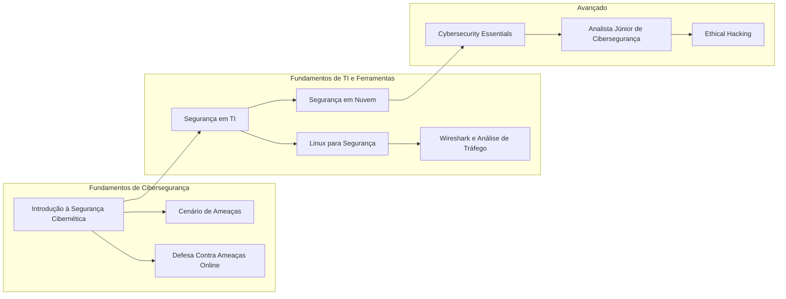

<h1 align="center">Fundamentos de Segurança da Informação

## Bem-vindo(a) ao primeiro passo dessa jornada!
&nbsp;&nbsp;&nbsp;&nbsp;Neste espaço, você terá acesso a conteúdos e conceitos fundamentais para iniciar sua jornada de estudos em segurança
 da informação. Após a conclusão dos cursos, acesse o PDF com o exercício para reforçar seu aprendizado. É altamente recomendável 
que você realize esse desafio, pois ele será a base para os próximos passos. Tente seguir a trilha de cursos conforme a sequência 
a baixo, qualquer dúvida perginte em nosso servidor no Discord. Dedique-se e aproveite ao máximo essa oportunidade de 
aprimoramento!

## Fundamentos:

1. **Introduction to Cybersecurity | Cisco**  
   [Introduction to Cybersecurity by Cisco: Free Online Course](https://www.netacad.com/courses/intro-cybersecurity)

2. **Segurança cibernética | IBM**  
   [Cursos gratuitos de segurança cibernética para estudantes | IBM SkillsBuild](https://www.ibm.com/skills/build)

3. **Como se defender contra ameaças Online | Academia Forense Digital**  
   [Fundamentos de Cibersegurança: Como se Defender Contra Ameaças Online](https://www.academiaforensedigital.com.br)

4. **Segurança em tecnologia da informação | Fundação Bradesco**  
   [Segurança em Tecnologia da Informação - Fundação Bradesco - Escola Virtual](https://www.ev.org.br)

5. **Fundamentos de segurança cibernética | Cisco**  
   [Cybersecurity Essentials Course with Real-World Scenarios](https://www.netacad.com/courses/cybersecurity-essentials)

6. **Cybersecurity | FIAP**  
   [FIAP EAD - Login](https://on.fiap.com.br)

7. **Introdução ao cenário de ameaças (EN)**  
   [Introduction to the Threat Landscape](https://www.cybrary.it/course/introduction-to-the-threat-landscape/)

8. **Introdução à segurança cibernética (EN)**  
   [Getting Started in Cybersecurity](https://www.cybrary.it/course/getting-started-in-cybersecurity/)

9. **Introdução técnica em cibersegurança (EN)**  
   [Technical Introduction to Cybersecurity](https://www.cybrary.it/course/technical-introduction-to-cybersecurity/)

10. **Junior Cybersecurity Analyst | Cisco**  
     [Junior Cybersecurity Analyst - Skills for All](https://www.netacad.com/pt/career-paths/cybersecurity?courseLang=pt-BR)

11. **Ethical Hacker | Cisco (EN)**  
    [Ethical Hacker - Skills for All](https://www.netacad.com/pt/courses/ethical-hacker?courseLang=en-US)

12. **Linux Fundamentos | FIAP**  
    [FIAP EAD - Login](https://on.fiap.com.br)

13. **Fundamentos da segurança em nuvem | Palo Alto**  
    [Cloud Security Fundamentals : Beacon](https://beacon.paloaltonetworks.com/student/collection/623418)

14. **Wireshark Do Iniciante ao Avançado | Youtube (EN) - Sem certificado**  
    [Wireshark Full Course 🦈| Wireshark Tutorial Beginner to Advance 🔆 Wireshark 2023](https://www.youtube.com/watch?v=ZxF6dXfQaNM)  
    **Ou**  
    **Wireshark analisando tráfego | Udemy R$39,90 - Com certificado**  
    [Wireshark Analisando Tráfego | Udemy](https://www.udemy.com/course/wireshark-analisando-trafego/)

## O que você deve saber ao terminar essa trilha:

&nbsp;&nbsp;&nbsp;&nbsp;Após a conclusão dos cursos, não se esqueça de realizar o exercício, especialmente se este for seu primeiro contato com Segurança da Informação.   
&nbsp;&nbsp;&nbsp;&nbsp;Sempre compartilhe seus novos certificados no LinkedIn para aumentar sua visibilidade e destacar seu desenvolvimento profissional.    
&nbsp;&nbsp;&nbsp;&nbsp;Esta foi uma introdução essencial ao tema, que servirá como base para os próximos módulos. No próximo, vamos explorar ferramentas que ajudarão a aplicar esses conceitos na prática e aprimorar suas habilidades na área.   

---  

## Vamos juntos fortalecer o conhecimento, Hive.Connect uma comunidade de todos, para todos!
