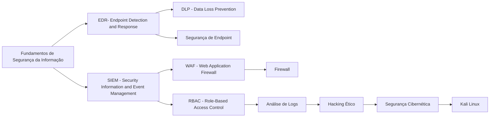

<h1 align="center">Iniciante Segurança da Informação

## Bem-vindo(a) a continuação dessa jornada em Segurança da Informação!
&nbsp;&nbsp;&nbsp;&nbsp;Agora que você possui uma base sólida de conhecimento, é hora de avançar para a próxima etapa, focando nas ferramentas, configurações e implementações práticas essenciais para a segurança da informação. Neste módulo, você aprenderá a aplicar conceitos como EDR, SIEM, DLP, segurança de endpoints, RBAC, WAF, firewalls e análise de logs, que são amplamente utilizados no mercado.
&nbsp;&nbsp;&nbsp;&nbsp;Após concluir os cursos, você terá acesso a PDFs com exercícios para reforçar seu aprendizado, agora esses novos desafios já são CTFs. Esses desafios são fundamentais para consolidar as habilidades adquiridas e preparar você para situações reais. Siga a sequência de cursos recomendada abaixo e, em caso de dúvidas, participe de nosso servidor no Discord. Dedique-se ao máximo e aproveite essa oportunidade para aprimorar suas habilidades na área de segurança cibernética.

## Fundamentos:

1. **EDR (Endpoint Detection and Response)**  
   **Guide to Endpoint Detection and Response (EDR)| Purple Academy**  
   [EDR Solutions: An Introduction to Endpoint Detection and Response](https://academy.picussecurity.com/course/endpoint-detection-and-response-edr-course)
  

2. **SIEM (Security Information and Event Management)**  
   **Learn SIEM with Splunk | Udemy**  
   [Learn SIEM with Splunk](https://www.udemy.com/course/learn-siem-with-splunk/)
 
   **Ou**  
   **Elastic Security - Fundamentos de SIEM | Udemy**  
   [Elastic Security - Fundamentos de SIEM](https://www.udemy.com/course/elastic-security-siem/?couponCode=KEEPLEARNINGBR)
   
   **Ou**  
   **OSSIM – Open Source SIEM Fundamentals | Udemy**  
   [OSSIM (Open Source SIEM)](https://www.udemy.com/course/ossim-open-source-siem-fundamentals/)

   **Ou**  
   **Wazuh for SIEM and Security Monitoring | Udemy**  
   [Wazuh for SIEM and Security Monitoring](https://www.udemy.com/course/wazuh-for-siem-and-security-monitoring/)

3. **DLP (Data Loss Prevention)**  
   **Data Loss Prevention: Implementation and Management | Pluralsight**  
   [Pluralsight DLP](https://www.pluralsight.com/courses/data-loss-prevention-implementation-management)
   
   **Ou**  
   **Symantec DLP 14.5: Configuration and Troubleshooting | Udemy**  
   [Udemy DLP](https://www.udemy.com/course/symantec-dlp-14-5-configuration-and-troubleshooting/)

4. **Segurança de Endpoint**  
   **Endpoint Security Fundamentals | Cybrary**  
   [Cybrary Endpoint Security](https://www.cybrary.it/course/endpoint-security-fundamentals/)

   **Ou**  
   **Endpoint Security Management | Udemy**  
   [Udemy Endpoint Security](https://www.udemy.com/course/endpoint-security-management/)

5. **RBAC (Role-Based Access Control)**  
   **O que é o controle de acesso baseado em função (RBAC)? | Redhat**  
   [RBAC (Role-Based Access Control)](https://www.redhat.com/pt-br/topics/security/what-is-role-based-access-control)

   **Ou**  
   **Implementing Role-Based Access Control | Udemy**  
   [Udemy RBAC](https://www.udemy.com/course/implementing-role-based-access-control/)

6. **WAF (Web Application Firewall)**  
   **Web Application Firewall Fundamentals | Udemy**  
   [Udemy WAF](https://www.udemy.com/course/web-application-firewall-fundamentals/)

7. **Firewall**  
   **FortiGate Firewall Training | Udemy**  
   [FortiGate Firewall Trainings](https://www.udemy.com/course/fortigate-firewall-training/?couponCode=KEEPLEARNINGBR)

8. **Análise de Logs**  
   **Log analysis - Detecting Web Attacks | Udemy**  
   [Log analysis ](https://www.udemy.com/course/log-analysis-detecting-web-attacks/?couponCode=KEEPLEARNINGBR)

## O que você deve saber ao terminar essa trilha:

- **Fundamentos de EDR (Endpoint Detection and Response):**  
   Compreensão dos conceitos de EDR, como detectar e responder a incidentes relacionados a endpoints, além de técnicas de hunting avançado e mitigação de riscos.
- **SIEM (Security Information and Event Management):**  
   Capacidade de implementar e gerenciar sistemas SIEM, como o Splunk, OSSIM e Wazuh, para monitoramento e correlação de eventos de segurança.
- **DLP (Data Loss Prevention):**  
   Conhecimento sobre como implementar soluções de prevenção de perda de dados (DLP), incluindo o uso do Symantec DLP para proteger dados sensíveis e gerenciar riscos de segurança relacionados à perda de dados.
- **Segurança de Endpoint:**  
   Compreensão dos conceitos de segurança de endpoints, como proteger dispositivos contra ameaças e implementar políticas de segurança para gerenciar e proteger os endpoints corporativos.
- **RBAC (Role-Based Access Control):**  
   Capacidade de implementar e gerenciar o controle de acesso baseado em funções (RBAC), garantindo que os acessos a sistemas e dados sejam feitos de forma segura e eficiente, respeitando as melhores práticas de IAM (Identity and Access Management).
- **WAF (Web Application Firewall):**  
   Conhecimento sobre como implementar e gerenciar firewalls de aplicação web (WAF), incluindo o uso de soluções como o AWS WAF para proteger aplicações na nuvem contra ataques e vulnerabilidades.
- **Firewall:**  
   Habilidade para configurar e gerenciar firewalls, desde os conceitos básicos até configurações avançadas, como em firewalls Cisco (FMC), garantindo a segurança da rede contra acessos não autorizados.
- **Análise de Logs:**  
   Habilidade para gerenciar e analisar logs de segurança, utilizando ferramentas como o ELK Stack (Elasticsearch, Logstash, Kibana) e outras plataformas de análise de logs para identificar ameaças e vulnerabilidades.
- **Práticas de Hacking Ético:**  
   Capacidade de realizar testes de intrusão e avaliações de segurança, utilizando ferramentas como Metasploit e Nmap para identificar falhas de segurança em sistemas e redes.

## Profissões
&nbsp;&nbsp;&nbsp;&nbsp;Com os conhecimentos adquiridos até o final dessa trilha, você terá uma excelente base para seguir nas carreiras de:

- Analista de Cloud  
- Profissional de SOC (Centro de Operações de Segurança)  
- Analista de Segurança da Informação  

## Livros

**EDR (Endpoint Detection and Response) - The Threat Hunter's Handbook**  
↳ [Link para compra na Amazon](https://www.amazon.com.br/Threat-Hunters-Handbook-Detection-Response/dp/1119623673)

**SIEM (Security Information and Event Management) - The Log Analysis Handbook**  
↳ [Link para compra na Amazon](https://www.amazon.com.br/Log-Analysis-Handbook-Security-Management/dp/1484241782)

**DLP (Data Loss Prevention) - Data Loss Prevention: A Comprehensive Guide to Preventing Data Leaks and Loss**  
↳ [Link para compra na Amazon](https://www.amazon.com.br/Data-Loss-Prevention-Comprehensive-Preventing/dp/1119643840)

**Segurança de Endpoint - Endpoint Security: A Complete Guide**  
↳ [Link para compra na Amazon](https://www.amazon.com.br/Endpoint-Security-Complete-Karl-Nicks/dp/1799982134)

**RBAC (Role-Based Access Control) - Identity and Access Management: Business Performance Through Connected Intelligence**  
↳ [Link para compra na Amazon](https://www.amazon.com.br/Identity-Access-Management-Performance-Intelligence/dp/0124199755)

**WAF (Web Application Firewall) - Web Application Security: A Beginner’s Guide**  
↳ [Link para compra na Amazon](https://www.amazon.com.br/Web-Application-Security-Beginners-Guide/dp/0071790109)

**Firewall - The Firewall: A Guide to Network Security**  
↳ [Link para compra na Amazon](https://www.amazon.com.br/Firewall-Guide-Network-Security-Protection/dp/1119210763)

**Análise de Logs - Logging and Log Management: The Authoritative Guide to Understanding the Concepts Surrounding Logging and Log Management**  
↳ [Link para compra na Amazon](https://www.amazon.com.br/Logging-Log-Management-Authoritative-Understanding/dp/0134096852)

**Hacking Ético - The Web Application Hacker's Handbook**  
↳ [Link para compra na Amazon](https://www.amazon.com.br/Web-Application-Hackers-Handbook-Exploiting/dp/1118026470)

**Segurança Cibernética - Cybersecurity and Cyberwar: What Everyone Needs to Know**  
↳ [Link para compra na Amazon](https://www.amazon.com.br/Cybersecurity-Cyberwar-Everyone-Needs-Know/dp/0199918098)

**Kali Linux - Kali Linux Revealed: Mastering the Penetration Testing Distribution**  
↳ [Link para compra na Amazon](https://www.amazon.com.br/Kali-Linux-Revealed-Mastering-Penetration/dp/0996396927)

## Orientações Finais
&nbsp;&nbsp;&nbsp;&nbsp;Após concluir os cursos, não deixe de realizar os exercícios. Agora estamos avançando para desafios de CTFs (Capture The Flag). Se você tem interesse em participar de grupo para realizar CTFs ou estudos, cadastre-se em nosso site e em seguida, participe de um dos CTFs ou do laboratório do módulo anterior. Após concluir, publique sobre sua experiência e marque a @Hive.connect no LinkedIn. Assim, iremos atribuir um cargo específico para você e garantir sua entrada no fórum exclusivo de Segurança da Informação.Temos diversas atividades em grupo focadas na área de Segurança da Informação, além de oferecer mentoria 1:1 e consultoria gratuita para currículos e perfis no LinkedIn.
&nbsp;&nbsp;&nbsp;&nbsp;Esta foi uma introdução essencial ao tema, que servirá como base para os próximos módulos. No próximo, vamos explorar ferramentas que ajudarão a aplicar esses conceitos na prática e aprimorar suas habilidades na área. Sempre compartilhe seus novos certificados no LinkedIn para aumentar sua visibilidade e destacar seu desenvolvimento profissional.  

---  

## Vamos juntos fortalecer o conhecimento, Hive.Connect uma comunidade de todos, para todos!
